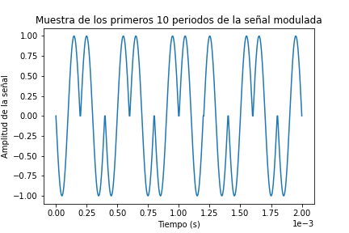
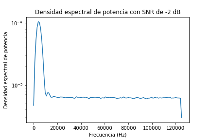
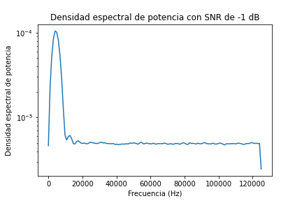
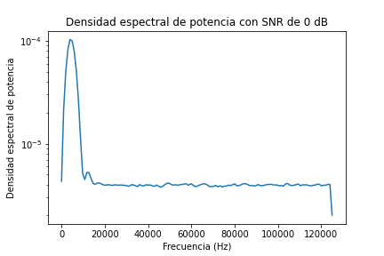
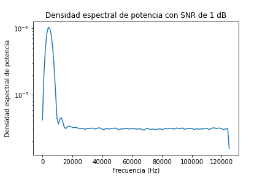
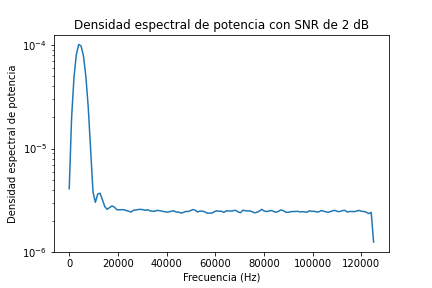
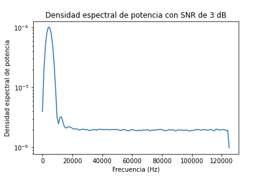

# Tarea 4: Modulación BPSK

Curso: IE0405-Modelos Probabilísticos de Señales y Sistemas  

Estudiante: Victor Manuel Yeom Song  

Carné: B78494  

## Inciso 1: Creación del esquema BPSK  

Un esquema de modulación [BPSK](https://www.gaussianwaves.com/2010/04/bpsk-modulation-and-demodulation-2/) es aquel donde la modulación de una señal digital se realiza con señales sinusoidales, las cuales se modulan según su fase. La "codificación" utilizada en esta tarea es la siguiente:

 para un bit igual a 1;
 para un bit igual a 0,

donde  es la frecuencia de la señal portadora y t el tiempo. Así, se tiene que la señal portadora en cada periodo tiene la siguiente forma:  

Inicialmente, se leen los bits del [archivo proveído en el enunciado](bits10k.csv) con el método `genfromtext()` de la biblioteca `numpy`. Esto produce un objeto iterable cuyos elementos corresponden a los bits del enunciado. Para la modulación se utilizó una frecuencia de la onda portadora de 5000 Hz, con 50 puntos de muestra para graficar cada figura de esta tarea. Se utilizó una frecuencia de muestreo de 250 kHz para asegurar el cumplimiento de la *frecuencia de muestreo de Nyquist* y que se genere una representación fiel de la señal. Para crear la señal, simplemente se definieron estos parámetros y se creó un objeto iterable de tipo `linspace` que se ajusta a los mismos con 0 en todos sus elementos. Luego, en cada espacio de un periodo se sumó la señal sinusoidal asociada al bit correspondiente.

Con los primeros 10 bits del archivo CSV, se obtiene la señal modulada con la siguiente forma:

Con el conocimiento de cómo está modulada la señal, se puede "leer" que la señal representa el string de bits "0101011010", el cual se puede corroborar en el [archivo CSV](bits10k.csv) como correcto.

## Inciso 2: Cálculo de la potencia promedio de la señal modulada generada

Se calcula la potencia promedio de la señal con la fórmula vista en clase:  

  

donde x es la señal cuya potencia se desea calcular y T el intervalo de tiempo donde se integra la señal. Para obtener esta integral en el caso de nuestra señal, simplemente se toma la variable con la señal, se eleva al cuadrado y se integra con una integral trapezoidal, dada por `integrate.trapz` de la biblioteca `scipy`. Así, se obtiene que la potencia promedio de la señal modulada generada es dada por el valor numérico:

## Inciso 3: Simulación del canal ruidoso AWGN

Se simula un canal ruidoso AWGN con niveles de SNR entre -2 dB y 3 dB. Primero, se debe notar que el SNR se define por la fórmula:

Donde  es la potencia de la señal original y  la del ruido. Entonces, despejando, se tiene que la potencia del ruido es dada por:

Luego, se tiene que para un ruido blanco con distribución gaussiana, la potencia es igual a la varianza de la distribucion. Es decir, , por lo que la desviación estándar de la distribución de ruido blanco obedece la relación . Entonces, a partir de este dato, simplemente se define una lista con los valores de SNR deseados para el análisis (con 1 dB de diferencia entre cada uno) y se realizan las simulaciones con cada nivel de SNR con un bucle `for` que itere sobre esta lista. Cada vez se suma ruido AWGN a la señal transmitida con la desviación estándar definida y un . Se obtuvieron los siguientes resultados de la señal recibida Rx:

### Señal recibida con SNR = -2 dB

### Señal recibida con SNR = -1 dB

### Señal recibida con SNR = 0 dB

### Señal recibida con SNR = 1 dB

### Señal recibida con SNR = 2 dB

### Señal recibida con SNR = 3 dB

Se puede ver que estos niveles de SNR son bastante ruidosos, lo cual se puede esperar dado que valores menores de SNR implican que la relación de potencias de la señal con respecto al ruido es baja (es decir, la potencia del ruido es altamente considerable con respecto a la de la señal original). También se puede observar que hay diferencias considerables en el ruido comparando el SNR de -2 dB con el de 3 dB, considerando que este último tiene menor distorsión por el ruido, como es de esperarse por su valor mayor de SNR.

## Inciso 4: Densidad espectral de potencia de las señales con el método de Welch

Se utiliza el método `welch` del módulo `scipy.signal` para obtener la densidad espectral de potencia de las señales. Se obtuvieron los siguientes resultados:

### Densidad espectral de la señal transmitida original

### Densidad espectral de la señal recibida con SNR = -2 dB

### Densidad espectral de la señal recibida con SNR = -1 dB

### Densidad espectral de la señal recibida con SNR = 0 dB

### Densidad espectral de la señal recibida con SNR = 1 dB

### Densidad espectral de la señal recibida con SNR = 2 dB

### Densidad espectral de la señal recibida con SNR = 3 dB

## Inicisos 5 y 6: Demodulación y decodificación de la señal recibida, con conteo de BER y su graficación

Para la demodulación y decodificación se utilizó el [producto interno](https://mathworld.wolfram.com/InnerProduct.html) de dos funciones. Este producto es definido por la relación:

Se aprovecha la equivalencia entre la integral en dominio continuo y la sumatoria en dominio discreto para aplicar esta relación en nuestro caso. Ahora, si se considera el intervalo  como un periodo de las señales,  la señal transmitida y  el "molde" (o bien la señal portadora), se tiene que:

si el bit asociado a  es 1 y 

si el bit asociado a  es 0. Entonces, en el primer caso se tendría que el producto interno es mayor que 0 y en el segundo que es menor a 0, dado que en este último caso el producto interno sería la suma de un seno cuadrado cuyos valores son menores o iguales a 0. 

Ahora, los valores exactos del producto interno van a diferir entre el caso de la señal modulada generada y la señal recibida, dado que esta última es ruidosa. Sin embargo, el AWGN debería tener un efecto similar sobre los periodos de seno positivos y negativos, por lo que se considera el umbral para decodificar la señal en 0, considerando que los productos internos posiblemente tendrán valores suficientemente grandes en magnitud para que se mantenga la relación antes descrita con la adición de los niveles mencionados de ruido blanco. Entonces, se obtiene la gráfica de BER en función del SNR:

Se ve que el BER se mantiene en 0 para los niveles de ruido solicitados, por lo que se verifica la validez del umbral de decodificación seleccionado.
